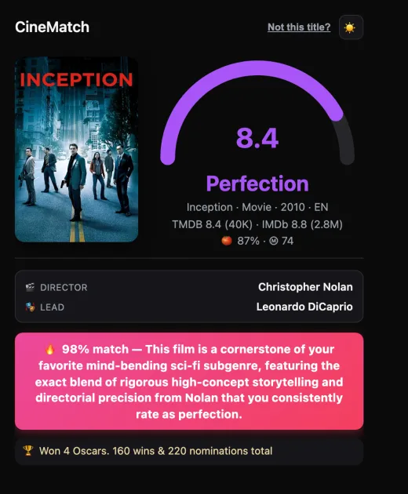
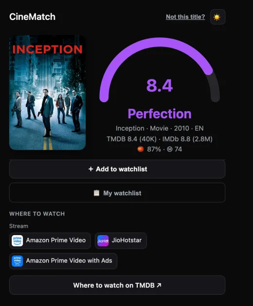
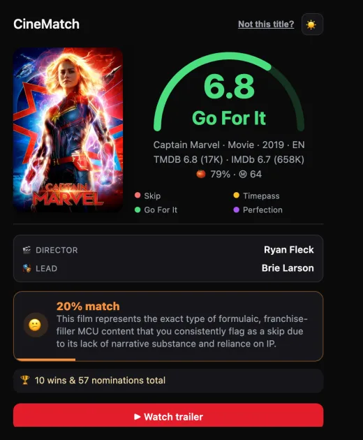
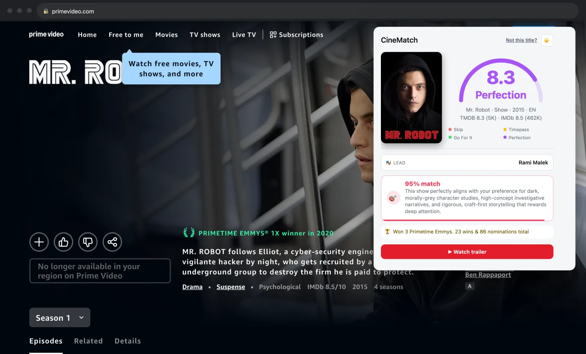
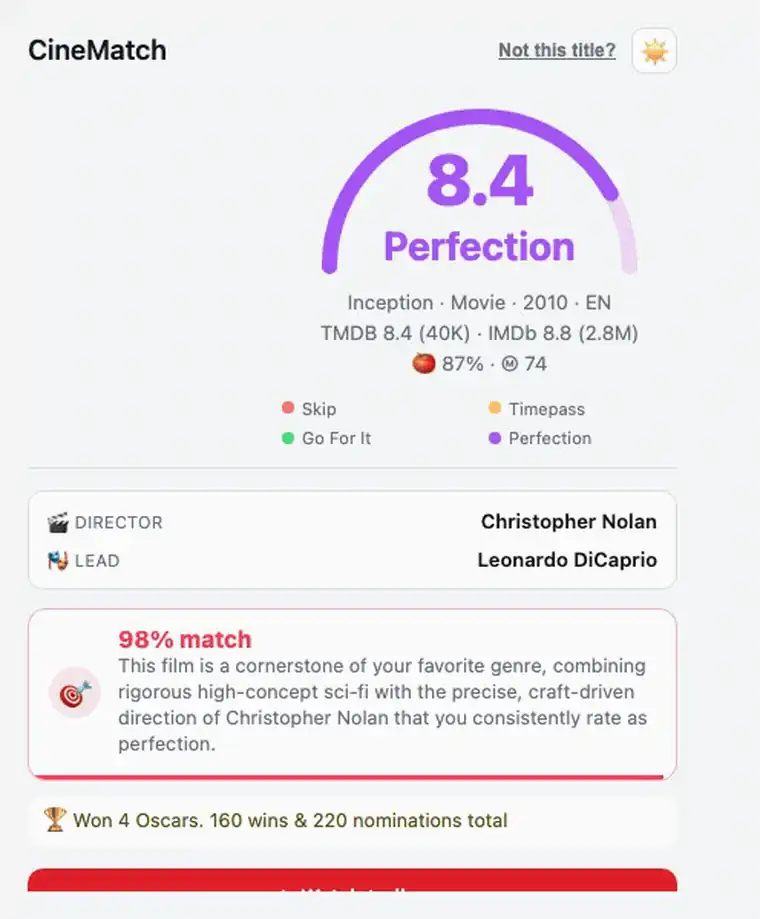

# CineMatch 🎬

> A Chrome extension that answers one question on any movie/show page: **should you watch it?**
> It shows a verdict on a 4-point scale — **Skip · Timepass · Go For It · Perfection** — from the
> TMDB rating, plus a personalised "for you" line based on your own taste, a **YouTube trailer** to
> judge for yourself, and **where to watch** it (streaming/rent/buy).

The verdict (the meter) is **objective** — it comes straight from the TMDB rating band and is never
altered. Personalisation is a **separate** attention-grabbing line ("🔥 Peak you — exactly your
taste") derived from how the title's **genres, director, and lead actor** line up with the films
you've rated highly.

## Screenshots

<p>
  
  
  
</p>

On any movie page — here the popup open on a Prime Video title:



**Demo** — score → scroll to where-to-watch → search → taste variants → mood → light theme:



…and full-screen, the popup open on a real streaming page:


---

## How it works

```
 movie page ──content.js──▶ popup ──GET /score?title=──▶ backend ──▶ TMDB (rating + genres)
 (Netflix, …)                                             │              │
                                                          ▼              ▼
                                   verdictBand(rating)          ScoreCache (Mongo)
                                          │                            │
              LLM taste (Gemini + taste-profile.md) ──▶ taste-match    │
                                          │                            │
                          verdict + taste-match ◀────────────── number + verdict in popup
```

The popup also shows the **director + lead actor**, **awards**, and cross-site ratings with vote
counts — **TMDB · IMDb · Rotten Tomatoes · Metacritic** (via OMDb) — plus an **＋ Add to watchlist**
button and a taste-ranked **My watchlist**. Your taste profile is loaded once by seeding a JSON file
(see [Add a taste profile](#add-a-taste-profile)).

## Repo layout

| Path | What |
|------|------|
| `extension/` | Chrome extension, vanilla JS, Manifest v3 (load unpacked). |
| `backend/` | Node + Express + TypeScript API. Layered: **route → controller → logic → service / model**. |
| `e2e/` | Playwright end-to-end test for the popup. |
| `deploy/`, `.github/workflows/` | Nginx config + CI/CD (test on push, deploy on merge to `main`). |

### Backend architecture
- **route** — maps a path to a controller method (thin).
- **controller** — class; validates input with Zod, calls a logic class, returns an `ApiResponse<T>` with the right status. No business logic.
- **logic** — class implementing `ILogic<I,O>` with `execute()` as the single entry (everything else a private method). One per operation (`ScoreLogic`, `RecommendLogic`, `SyncProfileLogic`, `WatchlistLogic`, `LlmTaste`, `LlmRecommend`), plus the shared `MovieLookup`.
- **service** — third-party HTTP clients only (`TmdbService`, `OmdbService`): fetch + auth, no shaping, no DB.
- **adapter** — class implementing `IAdapter<Raw,Out>` with `adapt()`; maps a raw third-party response to our domain type (`TmdbAdapter`, `OmdbAdapter`). Keeps services thin.
- **model** — Mongoose model + static functions for all DB access (`Profile`, `ScoreCache`).

Shared pure helpers live in `lib/` (e.g. `lib/affinity.ts`). Everything is wired in one composition root (`src/app.ts`) and depends on interfaces, so it's easy to swap/mock.

## Scoring

| TMDB rating | Verdict |
|---|---|
| `0–4` | Skip |
| `4–6` | Timepass |
| `6–7.5` | Go For It |
| `7.5–10` | Perfection |

**Taste match** (separate from the verdict): a personalised "for you" line, powered by an LLM.
Set a `GEMINI_API_KEY` and the taste line is produced by Gemini reasoning over a **precomputed taste
profile** (`backend/taste-profile.md` — a compact prose summary of your ratings: favourite
directors/genres, the tone/structure/pacing you gravitate to, and explicit turn-offs). Analysing the
profile once, offline, keeps every `/score` prompt small and fast — versus stuffing hundreds of raw
ratings into each call. It matches on *tone, themes, and director/cast patterns*, not just
genre/name overlap, and returns a **match score + one-line why** (e.g.
`🔥 98% match — mind-bending Nolan sci-fi with the tight screenplay you love`). Constrained JSON
decoding keeps replies well-formed. Cached per title (6h). `GEMINI_MODEL` can be a
**comma-separated fallback chain** — each free model has its own daily quota, so on a `429`/`503` the
next model is tried. When *every* Gemini model is exhausted, an optional **Groq** provider
(`GROQ_API_KEY`, far higher free daily limits — `llama-3.3-70b-versatile` by default) is tried next;
only when that's gone too is the taste line omitted (never blocks a score). When a **non-primary
model** answers, the taste line shows a tiny `via <model>` tag in the corner so it's obvious a
fallback was used. No `GEMINI_API_KEY`/`GROQ_API_KEY` → verdict only, no taste line. The objective
verdict is untouched either way.

**Recommendations (`/recommend`)** are LLM-based too: Gemini suggests titles your taste profile
would rate *Go For It* / *Perfection* (optionally filtered by a mood or genre), excluding anything
you've already watched, each resolved on TMDB (so hallucinations drop out). With no `GEMINI_API_KEY`
it falls back to a thin mood→genre→TMDB-discover, so recommend + the mood chips still work.

**Same-name titles.** When several films share a title, an on-page year decides. With no year, the
tie is broken by **language priority** — the languages you actually watch most, learned from your
ratings at sync (e.g. a Bollywood/South viewer gets the Hindi/Tamil cut over a more-popular English
one). Falls back to TMDB popularity when nothing else distinguishes them.

---

## Design choices (why it's built this way)

- **A backend at all** — API keys (TMDB, OMDb) can't ship inside a browser extension; anyone can unpack it. The server holds the secrets and proxies the calls.
- **Cross-device** — watchlist + taste profile live server-side, so they follow you across browsers and machines instead of being trapped in one browser's storage.
- **MongoDB, not browser storage** — a shared, persistent lookup cache (instant repeat views, protects the TMDB quota) plus structured, queryable data that survives a reinstall.
- **Logic on the server** — the extension is a thin renderer; the taste algorithm, language priority, and match gates deploy server-side in seconds, with no Chrome Web Store review between iterations.
- **Security** — HTTPS (Let's Encrypt), per-IP rate limiting, input validation (Zod), and a bearer token (`SYNC_TOKEN`) guarding the profile-write endpoint. No user login — single-tenant by design.
- **Single-tenant** — one deployment = one person's taste. Fork it, add your keys, seed your ratings, and it re-tunes for you.
- **EC2 + Nginx + PM2 + GitHub Actions** — a persistent, always-on API + database and an end-to-end deploy pipeline. (A serverless proxy would also hide the keys; EC2 was a deliberate choice for a long-lived server + DB and the ops experience.)

## Run the backend

```bash
cd backend
npm install
cp .env.example .env      # fill TMDB tokens + MONGODB_URI + SYNC_TOKEN (OMDB_API_KEY optional)
npm run dev               # http://localhost:3000/health
npm test                  # vitest
```

**backend/.env**

| Var | Purpose |
|---|---|
| `TMDB_API_KEY` | TMDB v3 key (fallback). |
| `TMDB_READ_ACCESS_TOKEN` | TMDB v4 read token — sent as Bearer on API calls. |
| `MONGODB_URI` | MongoDB connection string. |
| `PORT` | HTTP port (default 3000). |
| `SYNC_TOKEN` | Bearer secret guarding `POST /sync-profile`. |
| `OMDB_API_KEY` | Optional — enables the awards + IMDb line ([free key](https://www.omdbapi.com/apikey.aspx)). |
| `GEMINI_API_KEY` | Optional — enables the LLM taste mode ([free key](https://aistudio.google.com/apikey)). Empty → statistical taste only. |
| `GEMINI_MODEL` | Gemini model(s) for the taste mode; comma-separated = fallback chain, each tried in order on quota errors (default `gemini-flash-lite-latest,gemini-2.5-flash`). |
| `HOME_LANGUAGES` | Your region's languages (comma-separated ISO 639-1) for same-name tie-breaking; home langs rank first, then English, then the rest (default an Indian-language set). |
| `BACKEND_URL` | Only for `npm run seed` (defaults to `http://localhost:$PORT`). |

Real `.env` files are gitignored; commit only `.env.example`.

## Install the extension

1. Open `chrome://extensions` and turn on **Developer mode** (top-right).
2. Click **Load unpacked** and select the `extension/` folder.
3. Pin the **CineMatch** icon. Click it on any movie/show page. Netflix, Prime, Hotstar, YouTube,
   Google, and Wikipedia have tuned detectors; **any other site** (IMDb, Letterboxd, Rotten Tomatoes,
   …) is detected on demand from its `og:title` / `<h1>` / URL. Wrong guess? Hit **"Not this title?"**
   in the header to search manually — your pick is remembered for that tab.
4. Point it at your backend: `extension/popup.js` → `DEFAULT_BACKEND` (defaults to a hosted URL; set
   your own after deploying).

## Add a taste profile

The taste-match line comes from your own ratings, loaded once via `POST /sync-profile`. **Seed a JSON
file** — the simplest path, works for anyone:

```bash
cd backend
# edit profile.example.json: records of { title, type, year, verdict }
npm run seed              # POSTs it to /sync-profile
```

`verdict` is one of `Skip | Timepass | Go For It | Perfection`. No profile → the extension still works,
you just get objective verdicts with no taste line. (`scripts/moctale-to-profile.ts` is an example
converter that turns an exported ratings dump into this shape — adapt it to your own source.)

## API

| Method | Route | Notes |
|---|---|---|
| GET | `/health` | Liveness. |
| GET | `/score?title=&year=` | Verdict + taste match + trailer + where-to-watch + director/actor + awards. |
| GET | `/recommend?mood=&genre=&limit=` | Scored picks (grid/browse fallback). |
| GET / POST / DELETE | `/watchlist` | List (taste-ranked), add, or remove a personal watchlist item. |
| POST | `/sync-profile` | Load ratings. **Bearer `SYNC_TOKEN` required.** |

All responses use `{ success, data?, error? }`.

## Deploy

Runs anywhere Node runs. A typical setup: **MongoDB Atlas** (free M0) + a small VM (e.g. AWS EC2
free tier) behind **Nginx** with a **Let's Encrypt** cert, plus the included GitHub Actions workflow
([.github/workflows/deploy.yml](.github/workflows/deploy.yml)) that runs tests and redeploys over SSH
on push to `main`. Set these repo secrets for auto-deploy: `EC2_HOST`, `EC2_USER`, `EC2_SSH_KEY`.
After deploying, point `DEFAULT_BACKEND` in [extension/popup.js](extension/popup.js) at your API URL.

## Fork it

CineMatch isn't tied to any one account — the verdict, taste line, recommendations, detection, and
watchlist all regenerate from **your** taste profile + seeded ratings. Fork, set your own `.env`,
and seed your ratings.

**To re-tune it to your taste (not the repo owner's):**
1. **Ratings** — get yours into `{ title, type, year, verdict }` JSON and `npm run seed`
   (`scripts/moctale-to-profile.ts` is an example converter; adapt it to your source). This drives
   the watchlist + language priority; the taste line/recommendations come from `taste-profile.md`.
2. **`HOME_LANGUAGES`** — set your region's language codes in `.env` (default is Indian languages).
3. **Taste profile** — `taste-profile.md` is gitignored and per-deployment. Generate your own from
   `taste-profile.example.md` (paste your ratings into an LLM, save the summary as
   `backend/taste-profile.md`), and set `GEMINI_API_KEY` + `GEMINI_MODEL`. Without it, there's no
   taste line and `/recommend` uses genre-discover.

## Tech

Vanilla JS (MV3) · Node 20 · Express · TypeScript · Mongoose · Zod · Gemini (+ Groq fallback) · Playwright · vitest.

## License

[MIT](LICENSE) © Aditya Amaiya.
